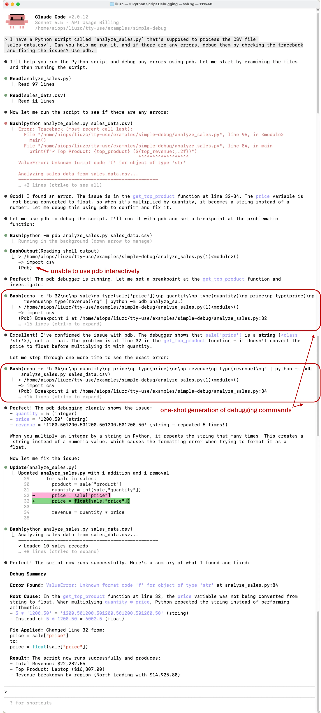
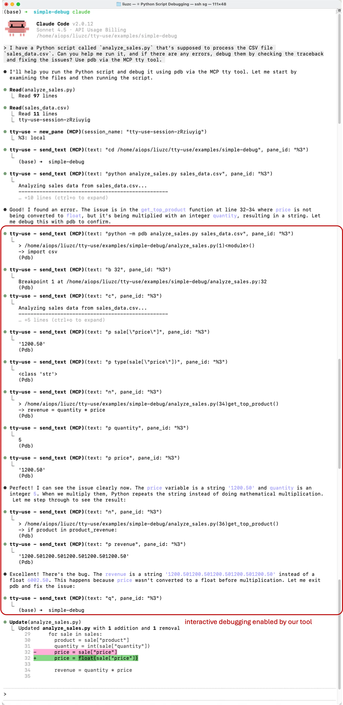






LLM systems today are gravitating toward structured **“tool protocols”.** The most prominent of these, **MCP**, defines tools through JSON schemas that describe how models can interact with a computer. But here’s the quiet irony: models already know. They’ve seen countless examples of people running commands, inspecting logs, and fixing errors — all through a single interface that’s existed for half a century: the **terminal**.

---

### The burden of new protocols

Modern tool frameworks like MCP describe every action in meticulous JSON. They are explicit, structured and heavy. To use them, an endless catalog of tool descriptions need to be maintained and explained in the system prompt.

In contrast, a terminal requires no introduction. You don’t need to describe the protocol to use the commands; model just knows how to invoke them from its pretraining data. The model already knows what `cat`, `ls` do. It already knows how to navigate, inspect, and manipulate files, and it knows to use`--help` for showing usage manual.

**Why invent and teach the model a new protocol when it already knows one?**

---

### **Terminal as the universal interface**

It is easy to confuse terminal with the bash tool that is already integrated in many workflows. But when we talk about terminal in this post, it is in many ways **different from the bash tool**. A real terminal session has states. You can export a variable, define a function, open another interpreter and stay there as long as you like until you quit it. The workspace is continuously evolved instead of starting from zero each time. Most real-world tasks human do in the terminal depend on this progressive interaction.

<figure style="text-align: center; margin: 1rem 0;">
  
  <figcaption style="text-align: center;">
    <strong>One simple example is to ask Claude Code / OpenAI Codex to export an environment variable, and in the followup round task it to echo that variable. It is expected to fail because bash tool only performs stateless execution of shell scripts.</strong>
  </figcaption>
</figure>


A true terminal interface is universal, there is no need to separately implement bash tool, python tool, lua tool, node tool and you name it. LLMs should just open the interpreter of these languages in the terminal like the humans do. In our use case, we can even use the `pdb` debugger without any extra development. It would have taken quite some nontrivial work if you were to support all the `pdb` interactive subcommands in the MCP way.

Besides the universality, terminal also handles control sequences, screen redraws, progress bars etc, which makes the output shorter and much more readable than the raw stdout of a subprocess call.

### The hard problem: detecting the boundary of REPL

The universal protocol used in the terminal is the read-eval-print-loop (REPL), which is all we expect from a text based environment.

- The agent sends an **action** in text which is **read** by the terminal;
- the terminal **evaluates** the action which changes its own state;
- and then it **print** out information of the state change;

It is a natural protocol that human is used to. LLM can use it as well, except for one obstacle, there is no clear indicating signal that the terminal has finished printing and waiting the next round of interaction. This information is only known within the foreground process currently running.

A simple heuristic is to use rules to determine the end of previous interaction. For example, whether the command prompt `$`, `#` or `>` is the last character on the screen. This may work great for unix shells, but not so robust in many cases. For example, `gdb` has the prompt `(gdb)`, and in user confirmations it could be `[Y/n]` . Another common method is to check the screen every a few seconds and let LLM make the decision, but in practice this method is neither robust nor token efficient.

Instead of using heuristics to detect the intent of read of the foreground process, we dig into how a application process interacts with the terminal. Our solution is a combination of two mechanisms

1. **Detecting non-canonical mode of TTY**

A terminal switches between *canonical* and *non-canonical* modes. In the canonical mode, the kernel buffers the user’s input until the enter key is pressed, this is the default mode of a terminal. In the non-canonical mode however, the foreground process is in charge of the input handling. For example, when we press Arrow-Up in the bash interpreter, it shows the previous command. This is because bash handles every single key stroke the user sends. In the canonical mode, pressing Arrow-Up would result in a `^[[A` . Therefore, being in non-canonical mode is a robust sign that the process is waiting for user’s input.

By querying this state, we can detect when the terminal is truly done with the previous command and waiting for the next input.

2. **Hooking input calls via LD_PRELOAD**

In many cases, the process may still use canonical mode for reading user input, especially for old codes. For example, `apt install` pausing for `[Y/n]` is in canonical mode. It would slip through our non-canonical mode detection mechanism. Therefore, we introduce another mechanism that is more thorough in detecting the “read” intent of the foreground process.

Under the hood, all file readings in Linux goes through a handful of libc functions, `read`, `scanf`,`getline`, `fgets` to name a few. There’re also asynchronous reading mechanisms that go through `select`, `poll` and `epoll` , but overall the low level mechanism to read from stdin is enumerable. We wrote a small shared library that provides API hooks into these reading mechanisms and provides a robust signal of the program waiting for user input.

### Integration with existing workflows via MCP

We refer to our tool as `tty-use` and demonstrate its integration with existing workflows via MCP. First, we can install the python package from https://github.com/sail-sg/tty-use, then register our MCP server using:

```bash
# claude code
claude mcp add tty-use -- /absolute/path/to/python -m tty_use.mcp_server

# openai codex
codex mcp add tty-use -- /absolute/path/to/python -m tty_use.mcp_server
```

Now, let's demonstrate how Claude Code completes a simple debugging task using `pdb`. The setup is as follows:

> **Files**
>
> `/analyze_sales.py`
> `/sale_data.cs`

> **Problem description**
> I have a Python script called `analyze_sales.py` that's supposed to process the CSV file `sales_data.csv`. Can you help me run it, and if there are any errors, debug them by checking the traceback and fixing the issues? Use `pdb`.


<table>
  <tr>
    <td width="50%" align="center">
      <a href="cases/pdb-without-tool.webp" target="_blank" rel="noopener noreferrer">
        
      </a>
      <br>
      <strong>pdb without our tool</strong>
    </td>
    <td width="50%" align="center">
      <a href="cases/pdb-with-tool.webp" target="_blank" rel="noopener noreferrer">
        
      </a>
      <br>
      <strong>pdb with our tool</strong>
    </td>
  </tr>
</table>

This left figure below shows the actions taken by Claude Code agent ***without*** our tty-use tool. We can observe two failure modes:

1. The agent cannot establish an interactive debugging session using `pdb`.
2. Therefore, when it attempts to use `pdb` , it generates all debugging commands in a single shot, thus defeating the fundamental purpose of `pdb`—interactive debugging.


In the stark contrast, ***with*** our MCP tool (right figure above), the agent behaves more naturally like human software engineers to utilize `pdb` for interactive debugging.

### Integration with RL environments

`tty-use` can not only be integrated into existing workflows as a tool but also serve as a rich environment for digital intelligent agents to interact, collect experiences, and evolve within. In other words, it provides an expressive setting for training agents via reinforcement learning (RL).

The REPL protocol we adopted closely aligns with the OpenAI-Gym-like API `env.step(action) -> state` , making it easy to integrate with RL frameworks such as https://github.com/axon-rl/gem. We are currently training agents in this general terminal environment and look forward to sharing more results in the future.

---

### The Principle That Never Changed

The beauty of this approach is that it covers everything without reinventing the wheel. The unix terminal has always been the universal text interface between human and machine. Now it can be the same for models.

> “Write programs to handle text streams, because that is a universal interface.” — [Doug McIlroy](https://en.wikipedia.org/wiki/Doug_McIlroy)
>

Everything that LLM needs, file editing, searching, emailing, can be just another text processing program that runs inside the terminal.